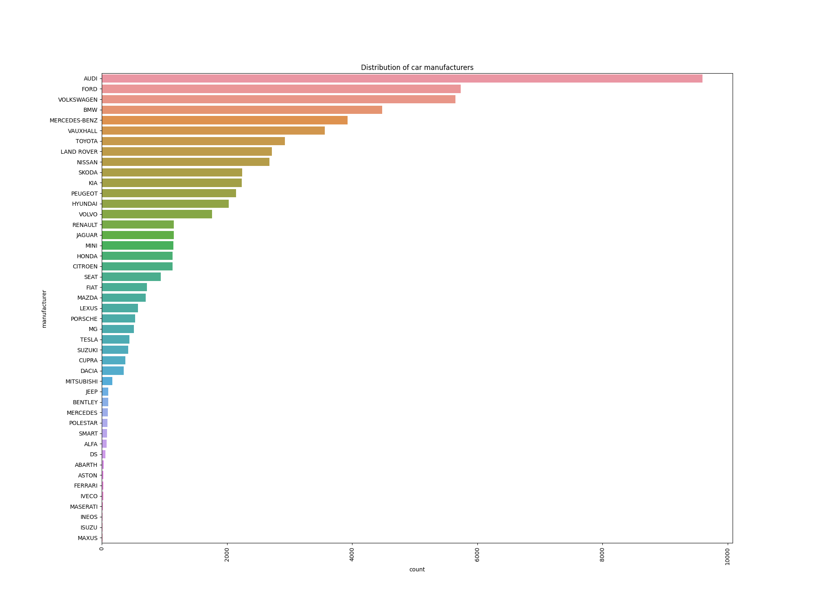
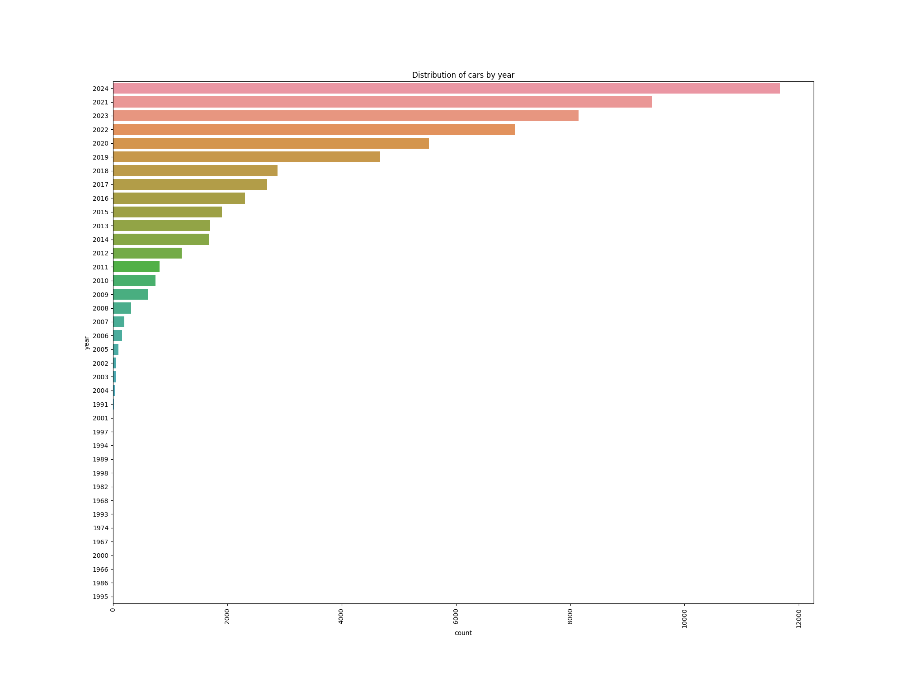
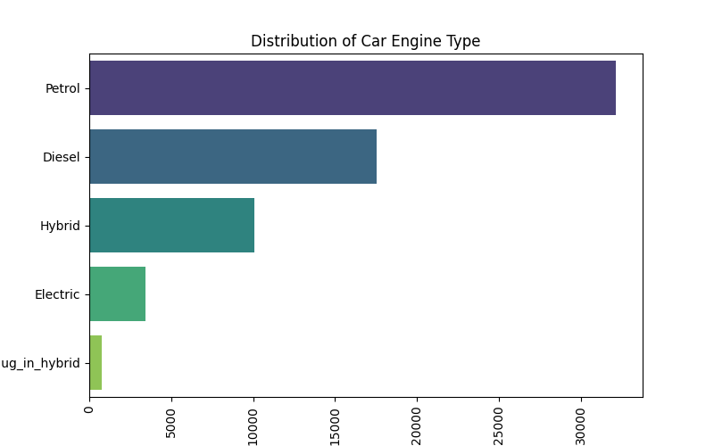
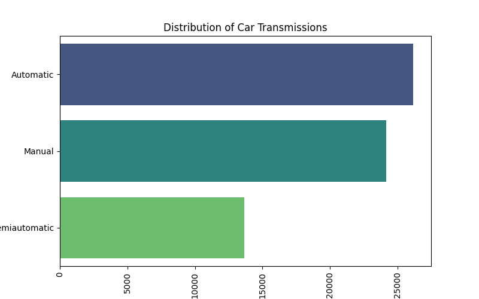

# Car Price Prediction Project

## Overview
A machine learning application that predicts used car prices using data scraped from AA Cars website. The project includes data scraping, cleaning, analysis, model building, and a web interface.

## Project Structure
- `app.py`: Main Streamlit web application
- `dataSet/`: Contains raw and cleaned car data
- `models/`: Trained machine learning models
- `notebooks/`: Jupyter notebooks for data processing and analysis
- `static/`: CSS and JavaScript files
- `templates/`: HTML templates

## Key Features
- Data scraping from AA Cars using BeautifulSoup
- Comprehensive data cleaning and preprocessing
- Exploratory data analysis with visualizations 
- Multiple ML models comparison (Linear Regression, Random Forest, etc.)
- Interactive web interface built with Streamlit

## Visualizations
### Distribution of Car Manufacturers


### Cars by Year


### Engine Types Distribution


### Transmission Types Distribution


### Manufacturer Word Cloud


## Model Performance
The CatBoost Regressor achieved the best performance after hyperparameter tuning using GridSearchCV.

## Web Application
Try the live demo: [Car Prediction App](https://share.streamlit.io/victorumunna/car-price-prediction/app.py)

## Technologies Used
- Python
- BeautifulSoup
- NumPy
- Matplotlib
- Seaborn
- Scikit-Learn
- Streamlit

## Getting Started
1. Install requirements:
```sh
pip install -r requirements.txt